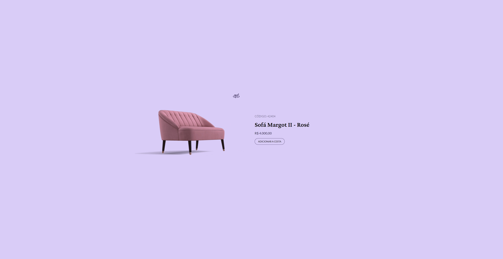

# Desafio #2: Product Card

Resolução do 2° desafio proposto pela **rocketseat**, durante a iniciativa **#boracodar** que aconteceu no mês de janeiro de 2023.

---

## O Desafio

O Desafio consiste em reproduzir o layout do projeto, e através de uma gif uma ``.gif`` realizar uma animação do produto se movimentando.

## O Desafio

O Desafio consiste em reproduzir o layout do projeto, e através de uma gif uma ``.gif`` realizar uma animação do produto se movimentando.

## 🚀 Tecnologias

Esse projeto foi desenvolvido visando aprender Vue 3.

## 🔖 Layout

Você pode visualizar o layout do projeto através [DESSE LINK](https://www.figma.com/file/ZDEDUfRx9SzJ3MQmP0VBEn/%23boraCodar---Desafio-2-(Community)?node-id=1-133&t=jnO4LKCPo4wDDZG9-0). É necessário ter conta no Figma para acessá-lo.

---

Feito com ❤️ por [Gustavo Sorati](https://github.com/gustavo-sorati). 
