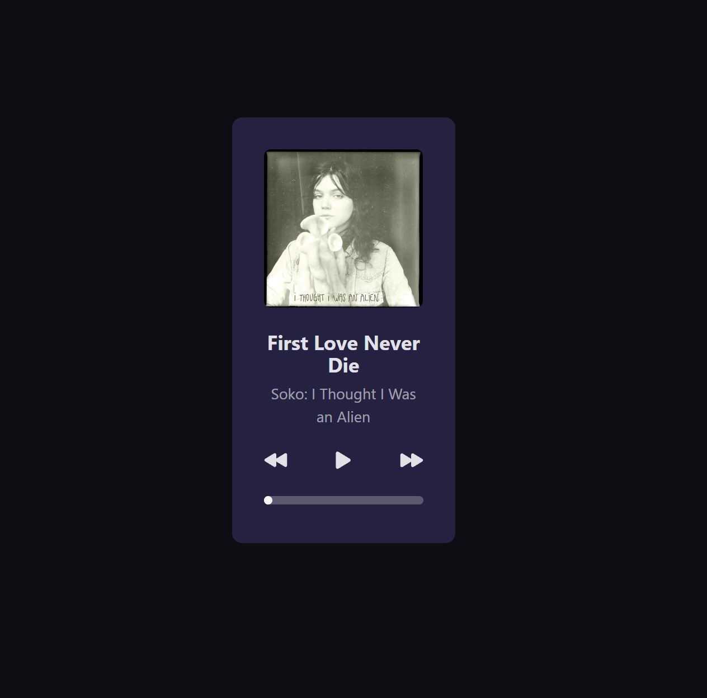

# Desafio #1: MP3 Player

Resolução do 1° desafio proposto pela **rocketseat**, durante a iniciativa **#boracodar** que aconteceu no mês de janeiro de 2023.

---

## O Desafio

O Desafio consiste em desenvolver um mp3 player  para escutar músicas.

## 🚀 Tecnologias

Esse projeto foi desenvolvido visando aprender Vue 3, então utilizei apenas Vue 3.

## 🔖 Layout

Você pode visualizar o layout do projeto através [DESSE LINK](https://www.figma.com/file/RPfBJtFAqGR7Q69G9Yb0MJ/%23boraCodar---Desafio-1?node-id=0-1&t=CbLIxxuc1N5BU3cR-0). É necessário ter conta no Figma para acessá-lo.

---

Feito com ❤️ por [Gustavo Sorati](https://github.com/gustavo-sorati). 
