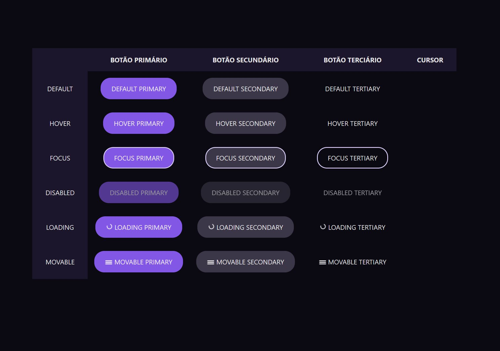

# Desafio #3: Botões e Cursores

Resolução do 3° desafio proposto pela **rocketseat**, durante a iniciativa **#boracodar** que aconteceu no mês de janeiro de 2023.

---

## O Desafio

O Desafio consiste em reproduzir o layout do projeto, exibindo diferentes tipos de botões que correspondem a diferentes ações.

## 🚀 Tecnologias

Esse projeto foi desenvolvido inteiramene com Vue 3.

## 🔖 Layout

Você pode visualizar o layout do projeto através [DESSE LINK](https://www.figma.com/file/9v0L1ci4PQuwrsxhw8J2lQ/%23boraCodar---Desafio-3-(Community)?node-id=0-1&t=RMNllO8ZfBNHI4dV-0). É necessário ter conta no Figma para acessá-lo.

---

Feito com ❤️ por [Gustavo Sorati](https://github.com/gustavo-sorati). 
